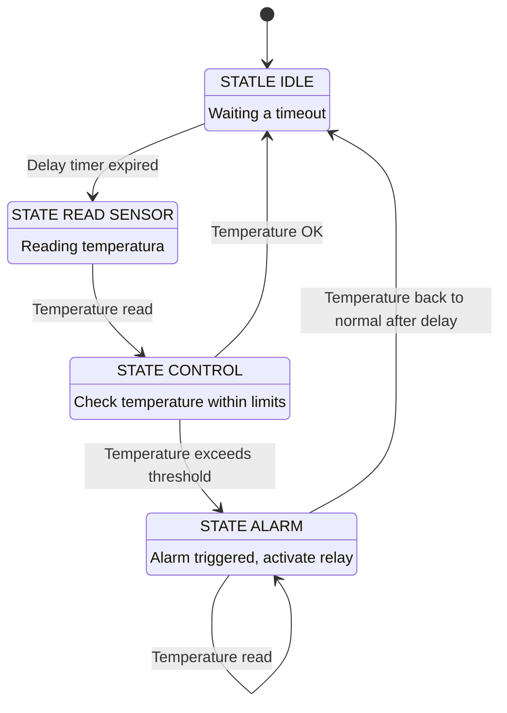

### Trabajo Práctico Final: Estación de Control de Temperatura

## Programación de Microcontroladores
## Protocolos de Comunicación en Sistemas Embebidos

* Alumno: Ing. Agustín Jesús Vazquez

* Profesor PdM: Mg. Ing. Patricio Bos
* Profesor PCSE: Ing. Israel Pavelek

# Descripción del proyecto

La aplicación propuesta consiste en la medición de los parámetros de temperatura, presión y humedad, a través del sensor BME680. 
Los resultados de dichas mediciones se visualizan en un display LCD 1602.

## FINITE STATE MACHINE

