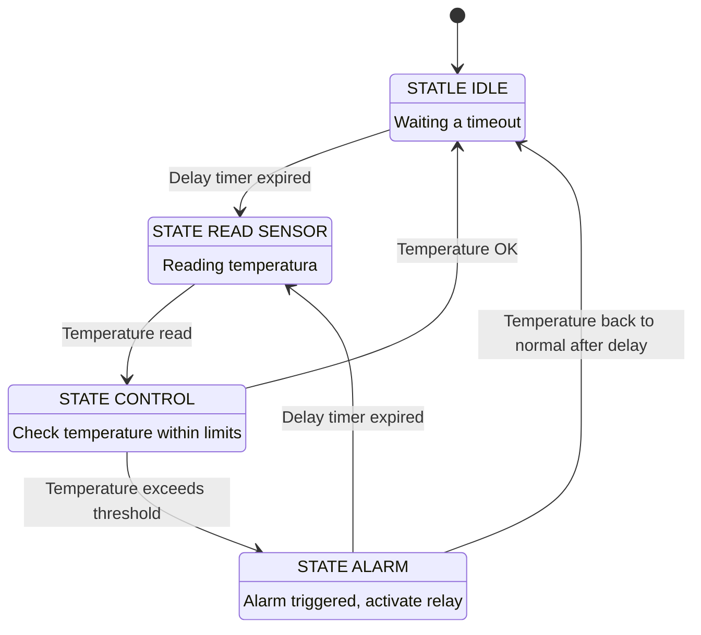

## FINITE STATE MACHINE

```mermaid
stateDiagram-v2
[*] --> SI
state "STATLE IDLE" AS SI: Waiting a timeout
state "STATE READ SENSOR" as SRS: Reading temperatura
state "STATE CONTROL" as SC: Check temperature within limits
state "STATE ALARM" as SA: Alarm triggered, activate relay
SI --> SRS : Delay timer expired
SRS --> SC : Temperature read
SC --> SI  : Temperature OK
SC --> SA  : Temperature exceeds threshold
SA --> SI  : Temperature back to normal after delay
SA --> SRS : Delay timer expired
```
